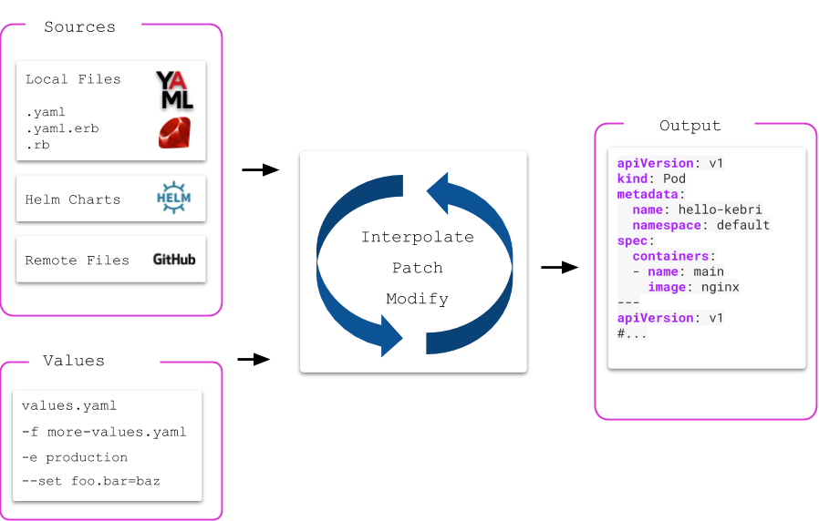

# Kerbi

[](https://codecov.io/gh/nectar-cs/kerbi)
[](https://badge.fury.io/rb/kerbi)
[](https://opensource.org/licenses/MIT)


Kerbi (Kubernetes Emdedded Ruby Interpolator) is yet another templating engine for 
generating Kubernetes resource manifests. 

It enables multi-strategy, multi-source templating, giving you the freedom
to design highly specialized templating pipelines.  

**Features**:
- **Templating strategies**
  - embedding values and code into YAML files (e.g [Helm](https://github.com/helm/helm))
  - patching and overlaying YAML/objects (e.g [kustomize](https://github.com/kubernetes-sigs/kustomize))
  - serializing YAML from in-memory objects (e.g [jsonnet](https://github.com/google/jsonnet))
- **Manifest sources**
  - `yaml`
  - `yaml.erb`
  - `helm` charts
  - `github` files
  - `ruby` objects
- **Values**
  - Helm-like `values.yaml`, `-f special-values.yaml`, and inline `--set foo.bar=baz`
  - Integrated environment logic à la Kustomize, e.g `-e production`

**Non-Features**:
- Release management à la Helm, packaging, or any kind of manifest versioning
- Interfacing with Kubernetes clusters, building images, syncing, etc... Kerbi just outputs yaml 

## How it looks

Kerbi lets you write programmatic mixers in Ruby to orchestrate complex (or silly) templating logic:    

```ruby
class BackendMixer < Kerbi::Mixer
  def run
    super do |g|
      g.yamls in: './../common'
      g.yaml 'app-secret' if self.values[:secret]
      g.hash({kind: 'Deployment'})  #etc...

      g.patched_with yamls: ['company-annotations'] do |gp|
        gp.mixer ConfigMapMixer, root: self.values[:config]
        gp.chart id: 'bitnami/postgresql' 
        gp.github id: 'my-org/k8s', file: 'manifest.yaml'
      end
    end
  end 
end
```

Where YAML files may be static `.yaml` or ruby-embedded `.yaml.erb`, e.g: 

```yaml
#app-secret.yaml.erb
apiVersion: v1
kind: Secret
metadata:
  namespace: <%= namespace %>
  name: backend-app
data:
  attr-enc-key: "<%= Base64.encode64(values[:secrets][:attr_enc]) %>"
```

## How it works

Kerbi generates YAML from other YAMLs, [ERBs](https://www.stuartellis.name/articles/erb/), 
and Ruby files. As a user, you write `Kerbi::Mixer` Ruby classes
to orchestrate the templating.  

<p align="center">
  </img>
</p>

Conceptually, Kerbi is most similar to Helm. You create a `values.yaml` file and 
dynamic manifest files that consume them:


```ruby
class BarMixer < Kerbi::Mixer
  def run
    super {|g|g.hash foo: 'bar'}
  end 
end

class BazMixer < Kerbi::Mixer
  def run
    super {|g|g.hash foo: 'baz'}
  end 
end


kerbi.generators = [ BarMixer, BazMixer ]
puts kerbi.gen_yaml 
# => foo: bar 
# => ---
# => foo: baz
```

## Getting Started

Read the [documentation](https://nectar-cs.github.io/kerbi/#/getting-started) from Github Pages.

Alternatively, check out the [examples folder].